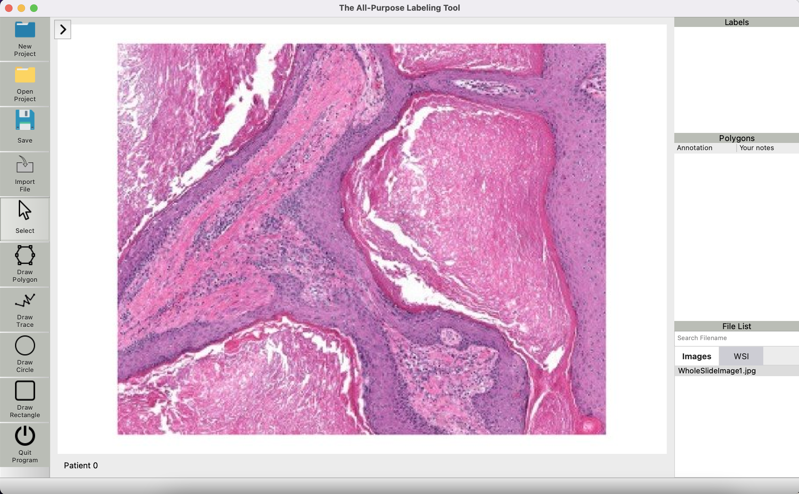

## Description
The All-Purpose Labeling Tool is a framework designed to offer simple and easy-to-use annotation possibilities for medical images. 
The underlying code is designed in a way that it can be integrated into a machine learning pipeline. 
Therefore, the framework offers many possibilities regarding not only medicine but also research and AI modelling.

The application is based on
[PyQT6](https://doc.qt.io/qtforpython/ "PyQT documentation") 
and allows for creating annotation projects where you can:

1. import your own images
2. assign patient names or IDs
3. mark areas in the image and assign labels to them




Over time, it is therefore possible to create extensive databases of annotated medical images, 
which may lay the foundation for information exchange or machine learning applications.

The framework is inspired by 
   [labelme](https://github.com/wkentaro/labelme "Labelme Github") with improved functionality.
This includes performance fixes, an altered structure and more readable code. Additionally, the drawing of shapes
is refined as well as the saving.

The underlying database is realized by [SQL](https://www.sqlite.org/index.html) which provides simple yet effective storing of the annotations.

## Usage
### First Project
After starting the software, it is possible to create an example project to get you started. 
Select "Macros -> Example" Project in the Menubar to do so.

### Creating Projects
Select "New Project" in the Menubar to open up the project manager. 
There, you can select a project directory and add your first images.
To open this project in your next session, click "Open Project" and navigate to your project directory. 
After selecting the database file, the project will open up again.

### Annotations
1. Open up the Toolbar on the left side
2. Select the desired drawing tool
3. Draw an area inside the image
4. Assign a label

### Database
Every time you save your changes, the annotations will be stored in the database. 
Click "Macros -> Preview Database" to preview the current version of the database and see how it fills up with every new annotation.

## Requirements
- Ubuntu / macOS / Windows
- Python 3

## Installation

This repository includes a submodule. Therefore, it can be either cloned using:
```bash
git clone --recurse-submodules https://github.com/FreshP-min/MedicalAnnotationFramework.git
cd MedicalAnnotationFramework
conda create -n taplt python=3.10 setuptools=65.5.1
conda activate taplt
pip install .  # add -e to use the cloned repository as the source for the package
python download_openslide.py
```
Or using:
```bash
git clone https://github.com/FreshP-min/MedicalAnnotationFramework.git
cd MedicalAnnotationFramework
conda create -n taplt python=3.10 setuptools=65.5.1
conda activate taplt
git submodule init
git submodule update
pip install .  # add -e to use the cloned repository as the source for the package
python download_openslide.py
```
Further information about submodules can be found [here](https://gist.github.com/gitaarik/8735255).

Launch the app with:
```bash
python -m taplt
```

Build the executable with:
```bash
pyinstaller taplt.spec  # creates and puts the executable in ./dist
```

## Acknowledgement
This project was ported from its original creation by Nico Lösch at [segmentation_utils](https://github.com/nicoloesch/segmentation_utils), which was inspired by [labelme](https://github.com/wkentaro/labelme "Labelme Github").
