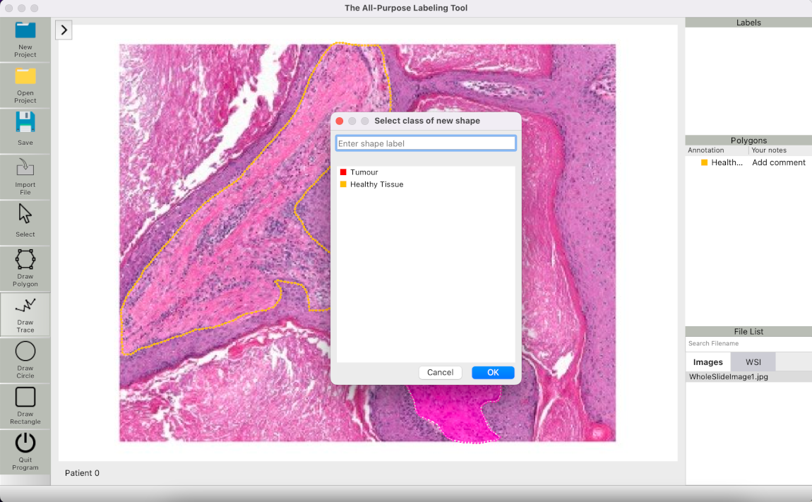
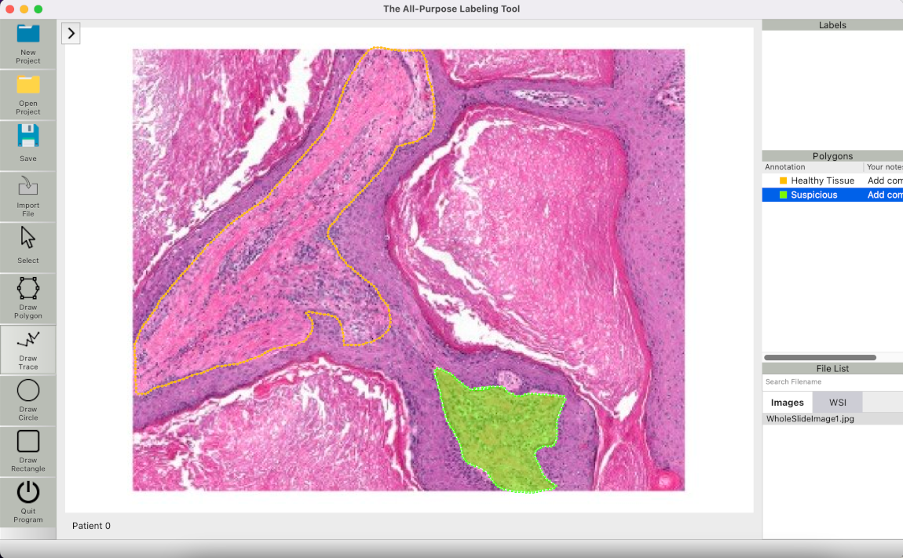

## Description
The All-Purpose Labeling Tool is a framework designed to offer simple and easy-to-use annotation possibilities for medical images. 
The underlying code is designed in a way that it can be integrated into a machine learning pipeline. 
Therefore, the framework offers many possibilities regarding not only medicine but also research and AI modelling.

The application is based on
[PyQT 5.15](https://doc.qt.io/qtforpython/ "PyQT documentation") 
and allows for creating annotation projects where you can:

1. import your own images
2. assign patient names or IDs
3. mark areas in the image and assign labels to them

Over time, it is therefore possible to create extensive databases of annotated medical images, 
which may lay the foundation for information exchange or machine learning applications.

The framework is inspired by 
   [labelme](https://github.com/wkentaro/labelme "Labelme Github") with improved functionality.
This includes performance fixes, an altered structure and more readable code. Additionally, the drawing of shapes
is refined as well as the saving.

The underlying database is realized by [SQL](https://www.sqlite.org/index.html) which provides simple yet effective storing of the annotations.

## Functionality
### Implemented Features
- tight SQL integration
- efficient labeling
- context menu

### To-Do and requested features
- export options for COCO/VOC Segmentation 
- undo/redo buttons to revert to previous states

## Requirements
- Ubuntu / macOS / Windows
- Python3
- [PyQt5](https://doc.qt.io/qtforpython/)

## Installation

something with setup.py ? I don't really know

## Acknowledgement
This project was ported from its original creation by Nico Lösch at [segmentation_utils](https://github.com/nicoloesch/segmentation_utils), which was inspired by [labelme](https://github.com/wkentaro/labelme "Labelme Github").
